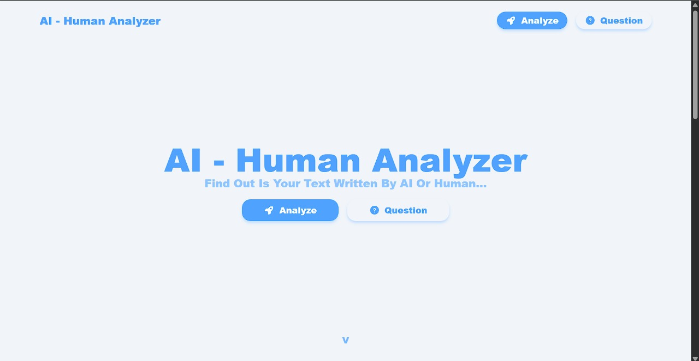
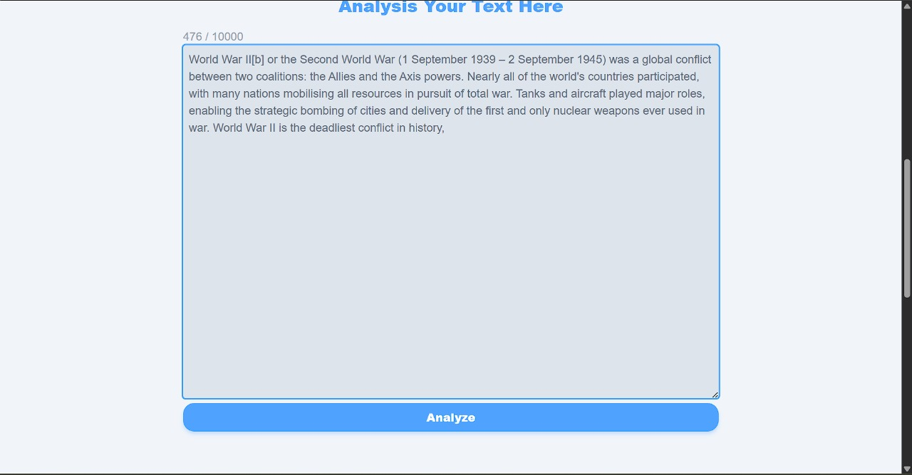
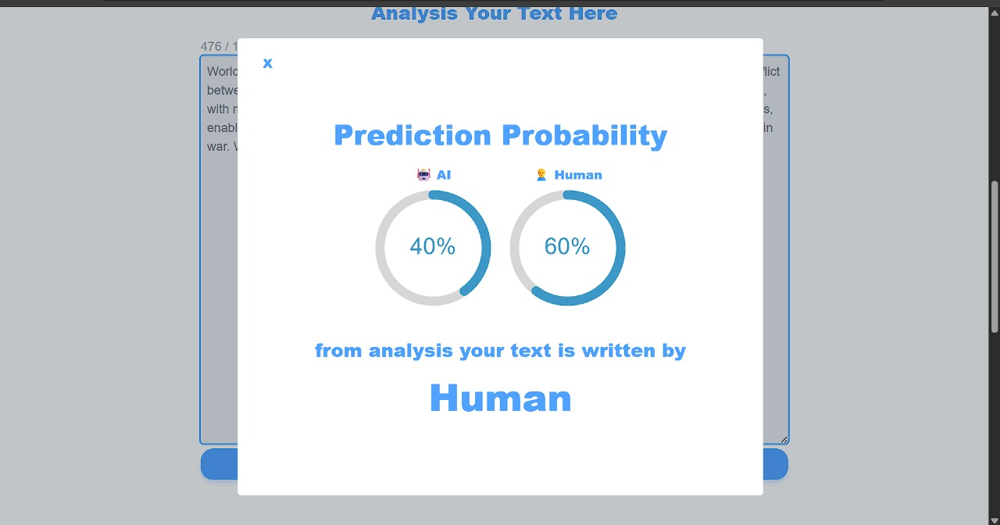
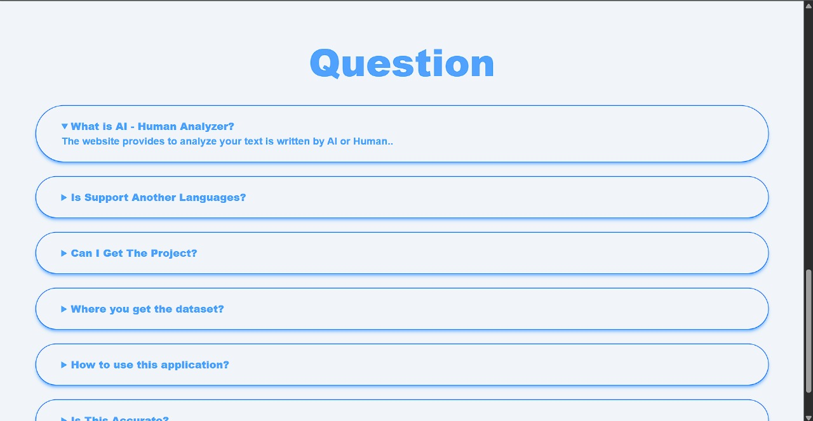

# AI Human Analyzer

Websites That Predict Your Text Is Written By AI or Human

<hr>

# Screenshot






# 🌍 Language

## | Indonesia

Website AI Human Analyzer adalah website yang dibangun microservices dengan menggunakan React + Vite dan Flask + Scikit-Learn berbasis open source.

# 🔧 Fitur

-   Memprediksi text apakah hasil buatan AI atau Manusia
-   Menggunakan tailwind untuk coloring
-   Open Source
-   Menggunakan dataset [AI vs Human](https://www.kaggle.com/datasets/shanegerami/ai-vs-human-text) yang sudah dilatih menggunakan scikit-learn

# ⚠️ Perhatian!

> Website ini hanya dalam tahap uji coba dan model machine learning juga bisa salah atau akurasi menurun

# 🧑‍💻Cara Install

-   Clone Repository ini

```bash
git clone https://github.com/R1TGAMING/AI-Human-Analyzer.git
```

-   Ganti Directory ke backend

```bash
cd backend
```

-   Install depedencies Python

```bash
pip install -r requirements.txt
```

-   Jalankan kode python

```bash
python main.py
```

-   Pergi ke folder frontend

```bash
cd frontend
```

-   Install depedencies frontend

```bash
npm install
```

-   Jalankan Kode Typescript / Website

```bash
npm run build
```

atau jika masa development

```bash
npm run dev
```

-   Pergi ke `http://<domain-or-localhost>:5173` untuk melihat hasil

# | English

Website AI Human Analyzer is a website build with a microservices that uses React + Vite and Flask + Scikit-Learn based open source.

# 🔧 Features

-   Predict the text is written by AI or Human
-   Use a tailwind for theme
-   Open Source
-   Use a dataset [AI vs Human](https://www.kaggle.com/datasets/shanegerami/ai-vs-human-text) was trained with scikit-learn

# ⚠️ Attention!

> this website is on testing and the model machine learning can wrong or accuracy will get down

# 🧑‍💻How To Install

-   Clone this Repository

```bash
git clone https://github.com/R1TGAMING/AI-Human-Analyzer.git
```

-   Change Directory to backend

```bash
cd backend
```

-   Install depedencies Python

```bash
pip install -r requirements.txt
```

-   Run python code

```bash
python main.py
```

-   Go to frontend folder

```bash
cd frontend
```

-   Install depedencies frontend

```bash
npm install
```

-   Run Typescript or Website code

```bash
npm run build
```

or if on development

```bash
npm run dev
```

-   go to `http://<domain-or-localhost>:5173` to view the result
